# Topia Empire ERD (Entity Relationship Diagram)

- **총 테이블 수**: 42개
- **데이터베이스**: MySQL 8
- **인코딩**: utf8mb4_unicode_ci

## 시스템별 구조

### 1. 핵심 (Core)

- `guilds` - 길드(서버) 정보

### 2. 재화 시스템 (Currency System)

- `currency_settings` - 재화 설정
- `topy_wallets` - 토피 지갑
- `ruby_wallets` - 루비 지갑
- `currency_transactions` - 거래 내역
- `currency_managers` - 재화 관리자
- `currency_multipliers` - 재화 배율
- `currency_category_multipliers` - 카테고리별 배율
- `currency_channel_categories` - 채널 카테고리 분류
- `currency_exclusions` - 재화 획득 제외 설정
- `currency_hot_times` - 핫타임 설정
- `daily_rewards` - 일일 보상
- `tax_history` - 세금 내역
- `bank_subscriptions` - 은행 구독
- `user_vaults` - 사용자 금고

### 3. 상점 시스템 (Shop System)

- `shop_items` - 상점 아이템 (v1)
- `shop_items_v2` - 상점 아이템 (v2)
- `shop_color_options` - 색상 옵션
- `shop_panel_settings` - 상점 패널 설정
- `user_items` - 사용자 보유 아이템 (v1)
- `user_items_v2` - 사용자 보유 아이템 (v2)
- `purchase_history` - 구매 내역
- `role_tickets` - 역할 티켓
- `ticket_role_options` - 티켓 역할 옵션

### 4. XP/레벨 시스템 (XP System)

- `xp_settings` - XP 설정
- `xp_users` - 사용자 XP/레벨
- `xp_multipliers` - XP 배율
- `xp_exclusions` - XP 획득 제외 설정
- `xp_hot_times` - XP 핫타임
- `xp_hot_time_channels` - 핫타임 채널
- `xp_level_requirements` - 레벨 요구 경험치
- `xp_level_rewards` - 레벨 보상
- `xp_level_channels` - 레벨별 채널 접근

### 5. 게임 시스템 (Game System)

- `game_settings` - 게임 설정
- `game_categories` - 게임 카테고리
- `games` - 게임
- `game_participants` - 게임 참가자
- `game_results` - 게임 결과

### 6. 마켓 시스템 (Market System)

- `market_settings` - 마켓 설정
- `market_listings` - 마켓 등록 상품

### 7. 기타

- `data_retention_settings` - 데이터 보관 설정
- `left_members` - 퇴장 멤버

---

## ERD 다이어그램

```mermaid
erDiagram
    %% ========================================
    %% 핵심 테이블
    %% ========================================
    guilds {
        varchar id PK "길드 ID"
        varchar name "길드 이름"
        varchar icon_url "아이콘 URL"
        varchar owner_id "소유자 ID"
        datetime joined_at "가입일"
        datetime left_at "퇴장일"
        datetime created_at "생성일"
        datetime updated_at "수정일"
    }

    %% ========================================
    %% 재화 시스템
    %% ========================================
    currency_settings {
        varchar guild_id PK,FK "길드 ID"
        tinyint enabled "활성화"
        varchar topy_name "토피 이름"
        varchar ruby_name "루비 이름"
        tinyint text_earn_enabled "텍스트 획득 활성화"
        int text_earn_min "텍스트 최소 획득"
        int text_earn_max "텍스트 최대 획득"
        int text_min_length "최소 글자수"
        int text_cooldown_seconds "텍스트 쿨다운"
        int text_max_per_cooldown "쿨다운당 최대"
        int text_daily_limit "일일 제한"
        tinyint voice_earn_enabled "음성 획득 활성화"
        int voice_earn_min "음성 최소 획득"
        int voice_earn_max "음성 최대 획득"
        int voice_cooldown_seconds "음성 쿨다운"
        int voice_daily_limit "음성 일일 제한"
        int min_transfer_topy "최소 토피 이체"
        int min_transfer_ruby "최소 루비 이체"
        decimal transfer_fee_topy_percent "토피 이체 수수료"
        decimal transfer_fee_ruby_percent "루비 이체 수수료"
        decimal shop_fee_topy_percent "상점 토피 수수료"
        decimal shop_fee_ruby_percent "상점 루비 수수료"
        varchar shop_channel_id "상점 채널"
        varchar shop_message_id "상점 메시지"
        tinyint monthly_tax_enabled "월세 활성화"
        decimal monthly_tax_percent "월세 비율"
    }

    topy_wallets {
        varchar guild_id PK,FK "길드 ID"
        varchar user_id PK "사용자 ID"
        bigint balance "잔액"
        bigint total_earned "총 획득"
        int daily_earned "일일 획득"
        datetime daily_reset_at "일일 리셋"
        datetime last_text_earn_at "마지막 텍스트 획득"
        int text_count_in_cooldown "쿨다운 내 텍스트 횟수"
        datetime last_voice_earn_at "마지막 음성 획득"
        int voice_count_in_cooldown "쿨다운 내 음성 횟수"
    }

    ruby_wallets {
        varchar guild_id PK,FK "길드 ID"
        varchar user_id PK "사용자 ID"
        bigint balance "잔액"
        bigint total_earned "총 획득"
    }

    currency_transactions {
        bigint id PK "ID"
        varchar guild_id FK "길드 ID"
        varchar user_id "사용자 ID"
        enum currency_type "재화 유형"
        enum transaction_type "거래 유형"
        bigint amount "금액"
        bigint balance_after "거래 후 잔액"
        bigint fee "수수료"
        varchar related_user_id "관련 사용자"
        text description "설명"
        datetime created_at "생성일"
    }

    currency_managers {
        int id PK "ID"
        varchar guild_id FK "길드 ID"
        varchar user_id "사용자 ID"
    }

    currency_multipliers {
        int id PK "ID"
        varchar guild_id FK "길드 ID"
        enum target_type "대상 유형"
        varchar target_id "대상 ID"
        decimal multiplier "배율"
    }

    currency_category_multipliers {
        int id PK "ID"
        varchar guild_id FK "길드 ID"
        enum category "카테고리"
        decimal multiplier "배율"
    }

    currency_channel_categories {
        int id PK "ID"
        varchar guild_id FK "길드 ID"
        varchar channel_id "채널 ID"
        enum category "카테고리"
    }

    currency_exclusions {
        int id PK "ID"
        varchar guild_id FK "길드 ID"
        enum target_type "대상 유형"
        varchar target_id "대상 ID"
    }

    currency_hot_times {
        int id PK "ID"
        varchar guild_id FK "길드 ID"
        enum type "유형"
        time start_time "시작 시간"
        time end_time "종료 시간"
        decimal multiplier "배율"
        tinyint enabled "활성화"
        json channel_ids "채널 ID 목록"
    }

    daily_rewards {
        varchar guild_id PK,FK "길드 ID"
        varchar user_id PK "사용자 ID"
        enum reward_type PK "보상 유형"
        datetime last_claimed_at "마지막 수령일"
        int streak_count "연속 횟수"
        int total_count "총 횟수"
    }

    tax_history {
        bigint id PK "ID"
        varchar guild_id FK "길드 ID"
        varchar user_id "사용자 ID"
        enum tax_type "세금 유형"
        decimal tax_percent "세율"
        bigint amount "금액"
        bigint balance_before "세금 전 잔액"
        bigint balance_after "세금 후 잔액"
        tinyint exempted "면제 여부"
        varchar exemption_reason "면제 사유"
        datetime processed_at "처리일"
    }

    bank_subscriptions {
        bigint id PK "ID"
        varchar guild_id "길드 ID"
        varchar user_id "사용자 ID"
        enum tier "등급"
        datetime starts_at "시작일"
        datetime expires_at "만료일"
    }

    user_vaults {
        bigint id PK "ID"
        varchar guild_id "길드 ID"
        varchar user_id "사용자 ID"
        bigint deposited_amount "예치 금액"
        datetime last_interest_at "마지막 이자 지급일"
    }

    %% ========================================
    %% 상점 시스템
    %% ========================================
    shop_items {
        int id PK "ID"
        varchar guild_id FK "길드 ID"
        varchar name "이름"
        text description "설명"
        bigint price "가격"
        enum currency_type "재화 유형"
        enum item_type "아이템 유형"
        int duration_days "기간(일)"
        varchar role_id "역할 ID"
        int stock "재고"
        int max_per_user "인당 최대"
        tinyint enabled "활성화"
    }

    shop_items_v2 {
        int id PK "ID"
        varchar guild_id "길드 ID"
        varchar name "이름"
        text description "설명"
        bigint topy_price "토피 가격"
        bigint ruby_price "루비 가격"
        enum currency_type "재화 유형"
        varchar item_type "아이템 유형"
        int duration_days "기간(일)"
        int stock "재고"
        int max_per_user "인당 최대"
        tinyint enabled "활성화"
    }

    shop_color_options {
        int id PK "ID"
        int item_id FK "아이템 ID"
        varchar color "색상 코드"
        varchar name "색상 이름"
        varchar role_id "역할 ID"
        bigint price "추가 가격"
    }

    shop_panel_settings {
        varchar guild_id PK "길드 ID"
        enum currency_type PK "재화 유형"
        varchar channel_id "채널 ID"
        varchar message_id "메시지 ID"
    }

    user_items {
        bigint id PK "ID"
        varchar guild_id FK "길드 ID"
        varchar user_id "사용자 ID"
        varchar item_type "아이템 유형"
        int quantity "수량"
        datetime expires_at "만료일"
    }

    user_items_v2 {
        bigint id PK "ID"
        varchar guild_id "길드 ID"
        varchar user_id "사용자 ID"
        int shop_item_id FK "상점 아이템 ID"
        int quantity "수량"
        datetime expires_at "만료일"
        varchar current_role_id "현재 역할 ID"
        datetime current_role_applied_at "역할 적용일"
        varchar fixed_role_id "고정 역할 ID"
        datetime role_expires_at "역할 만료일"
    }

    purchase_history {
        bigint id PK "ID"
        varchar guild_id FK "길드 ID"
        varchar user_id "사용자 ID"
        int item_id "아이템 ID"
        varchar item_name "아이템 이름"
        bigint price "가격"
        bigint fee "수수료"
        enum currency_type "재화 유형"
        datetime purchased_at "구매일"
    }

    role_tickets {
        int id PK "ID"
        varchar guild_id "길드 ID"
        varchar name "이름"
        text description "설명"
        int shop_item_id FK,UK "상점 아이템 ID"
        int consume_quantity "소비 수량"
        tinyint remove_previous_role "이전 역할 제거"
        varchar fixed_role_id "고정 역할 ID"
        bigint effect_duration_seconds "효과 지속시간(초)"
        tinyint enabled "활성화"
    }

    ticket_role_options {
        int id PK "ID"
        int ticket_id FK "티켓 ID"
        varchar role_id "역할 ID"
        varchar name "이름"
        text description "설명"
        int display_order "표시 순서"
    }

    %% ========================================
    %% XP/레벨 시스템
    %% ========================================
    xp_settings {
        varchar guild_id PK,FK "길드 ID"
        tinyint enabled "활성화"
        tinyint text_xp_enabled "텍스트 XP 활성화"
        int text_xp_min "텍스트 XP 최소"
        int text_xp_max "텍스트 XP 최대"
        int text_cooldown_seconds "텍스트 쿨다운"
        int text_max_per_cooldown "쿨다운당 최대"
        tinyint voice_xp_enabled "음성 XP 활성화"
        int voice_xp_min "음성 XP 최소"
        int voice_xp_max "음성 XP 최대"
        int voice_cooldown_seconds "음성 쿨다운"
        int voice_max_per_cooldown "쿨다운당 최대"
        varchar level_up_channel_id "레벨업 채널"
        text level_up_message "레벨업 메시지"
    }

    xp_users {
        varchar guild_id PK,FK "길드 ID"
        varchar user_id PK "사용자 ID"
        int xp "경험치"
        int level "레벨"
        datetime last_text_xp_at "마지막 텍스트 XP"
        int text_count_in_cooldown "쿨다운 내 텍스트 횟수"
        datetime last_voice_xp_at "마지막 음성 XP"
        int voice_count_in_cooldown "쿨다운 내 음성 횟수"
    }

    xp_multipliers {
        int id PK "ID"
        varchar guild_id FK "길드 ID"
        enum target_type "대상 유형"
        varchar target_id "대상 ID"
        decimal multiplier "배율"
    }

    xp_exclusions {
        int id PK "ID"
        varchar guild_id FK "길드 ID"
        enum target_type "대상 유형"
        varchar target_id "대상 ID"
    }

    xp_hot_times {
        int id PK "ID"
        varchar guild_id FK "길드 ID"
        enum type "유형"
        time start_time "시작 시간"
        time end_time "종료 시간"
        decimal multiplier "배율"
        tinyint enabled "활성화"
    }

    xp_hot_time_channels {
        int id PK "ID"
        int hot_time_id FK "핫타임 ID"
        varchar channel_id "채널 ID"
    }

    xp_level_requirements {
        varchar guild_id PK,FK "길드 ID"
        int level PK "레벨"
        int required_xp "필요 XP"
    }

    xp_level_rewards {
        int id PK "ID"
        varchar guild_id FK "길드 ID"
        int level "레벨"
        varchar role_id "역할 ID"
        tinyint remove_on_higher_level "상위 레벨시 제거"
    }

    xp_level_channels {
        int id PK "ID"
        varchar guild_id FK "길드 ID"
        int level "레벨"
        varchar channel_id "채널 ID"
    }

    %% ========================================
    %% 게임 시스템
    %% ========================================
    game_settings {
        varchar guild_id PK "길드 ID"
        varchar channel_id "채널 ID"
        varchar message_id "메시지 ID"
        varchar manager_role_id "관리자 역할"
        bigint entry_fee "참가비"
        json rank_rewards "순위 보상"
    }

    game_categories {
        int id PK "ID"
        varchar guild_id "길드 ID"
        varchar name "이름"
        int team_count "팀 수"
        tinyint enabled "활성화"
        int max_players_per_team "팀당 최대 인원"
        tinyint winner_takes_all "승자 독식"
        json rank_rewards "순위 보상"
    }

    games {
        bigint id PK "ID"
        varchar guild_id "길드 ID"
        varchar channel_id "채널 ID"
        varchar message_id "메시지 ID"
        int category_id FK "카테고리 ID"
        varchar title "제목"
        int team_count "팀 수"
        bigint entry_fee "참가비"
        bigint total_pool "총 상금"
        enum status "상태"
        varchar created_by "생성자"
        datetime finished_at "종료일"
        int max_players_per_team "팀당 최대 인원"
        json custom_rank_rewards "커스텀 순위 보상"
        tinyint custom_winner_takes_all "커스텀 승자 독식"
        bigint custom_entry_fee "커스텀 참가비"
    }

    game_participants {
        bigint id PK "ID"
        bigint game_id FK "게임 ID"
        varchar guild_id "길드 ID"
        varchar user_id "사용자 ID"
        int team_number "팀 번호"
        bigint entry_fee_paid "납부 참가비"
        bigint reward "보상"
        enum status "상태"
        datetime settled_at "정산일"
    }

    game_results {
        bigint id PK "ID"
        bigint game_id FK "게임 ID"
        int team_number "팀 번호"
        int rank "순위"
        int reward_percent "보상 비율"
        bigint total_reward "총 보상"
    }

    %% ========================================
    %% 마켓 시스템
    %% ========================================
    market_settings {
        varchar guild_id PK "길드 ID"
        varchar channel_id "채널 ID"
        varchar message_id "메시지 ID"
        tinyint topy_fee_percent "토피 수수료"
        tinyint ruby_fee_percent "루비 수수료"
    }

    market_listings {
        bigint id PK "ID"
        varchar guild_id FK "길드 ID"
        varchar seller_id "판매자 ID"
        varchar title "제목"
        text description "설명"
        enum category "카테고리"
        bigint price "가격"
        enum currency_type "재화 유형"
        enum status "상태"
        varchar buyer_id "구매자 ID"
        datetime expires_at "만료일"
        datetime sold_at "판매일"
    }

    %% ========================================
    %% 기타
    %% ========================================
    data_retention_settings {
        varchar guild_id PK,FK "길드 ID"
        int retention_days "보관 기간(일)"
    }

    left_members {
        varchar guild_id PK,FK "길드 ID"
        varchar user_id PK "사용자 ID"
        datetime left_at "퇴장일"
        datetime expires_at "만료일"
    }

    %% ========================================
    %% 관계 (Relationships)
    %% ========================================

    %% 길드 -> 재화 시스템
    guilds ||--o| currency_settings : "has"
    guilds ||--o{ topy_wallets : "has"
    guilds ||--o{ ruby_wallets : "has"
    guilds ||--o{ currency_transactions : "has"
    guilds ||--o{ currency_managers : "has"
    guilds ||--o{ currency_multipliers : "has"
    guilds ||--o{ currency_category_multipliers : "has"
    guilds ||--o{ currency_channel_categories : "has"
    guilds ||--o{ currency_exclusions : "has"
    guilds ||--o{ currency_hot_times : "has"
    guilds ||--o{ daily_rewards : "has"
    guilds ||--o{ tax_history : "has"

    %% 길드 -> 상점 시스템
    guilds ||--o{ shop_items : "has"
    guilds ||--o{ user_items : "has"
    guilds ||--o{ purchase_history : "has"

    %% 상점 아이템 관계
    shop_items ||--o{ shop_color_options : "has"
    shop_items_v2 ||--o| role_tickets : "linked to"
    shop_items_v2 ||--o{ user_items_v2 : "owned by users"
    role_tickets ||--o{ ticket_role_options : "has"

    %% 길드 -> XP 시스템
    guilds ||--o| xp_settings : "has"
    guilds ||--o{ xp_users : "has"
    guilds ||--o{ xp_multipliers : "has"
    guilds ||--o{ xp_exclusions : "has"
    guilds ||--o{ xp_hot_times : "has"
    guilds ||--o{ xp_level_requirements : "has"
    guilds ||--o{ xp_level_rewards : "has"
    guilds ||--o{ xp_level_channels : "has"

    %% XP 핫타임 채널
    xp_hot_times ||--o{ xp_hot_time_channels : "has"

    %% 게임 시스템 (논리적 관계)
    game_categories ||--o{ games : "categorizes"
    games ||--o{ game_participants : "has"
    games ||--o{ game_results : "has"

    %% 길드 -> 마켓 시스템
    guilds ||--o{ market_listings : "has"

    %% 길드 -> 기타
    guilds ||--o| data_retention_settings : "has"
    guilds ||--o{ left_members : "tracks"
```

---

## 테이블별 상세 설명

### guilds (길드)

Discord 서버(길드) 정보를 저장하는 핵심 테이블입니다. 대부분의 테이블이 이 테이블을 참조합니다.

### currency_settings (재화 설정)

길드별 재화 시스템 설정을 저장합니다.

- 토피/루비 이름 커스터마이징
- 텍스트/음성 채팅 재화 획득 설정
- 이체 수수료, 상점 수수료 설정
- 월세(세금) 설정

### topy_wallets / ruby_wallets (지갑)

사용자별 토피/루비 잔액을 저장합니다.

- 복합 PK: (guild_id, user_id)
- 쿨다운 및 일일 획득량 추적

### shop_items_v2 (상점 아이템 v2)

새로운 상점 시스템의 아이템 정의입니다.

- 토피/루비 동시 가격 설정 가능
- 역할 티켓 연동 가능

### role_tickets (역할 티켓)

상점 아이템과 연결된 역할 부여 티켓입니다.

- `shop_item_id`: shop_items_v2와 1:1 관계
- 다중 역할 옵션 지원 (ticket_role_options)

### games / game_participants / game_results

게임 시스템의 핵심 테이블들입니다.

- 게임 생성 -> 참가자 등록 -> 결과 기록 흐름

### user_vaults (금고)

사용자별 토피 예치 금고입니다.

- 이자 지급 기능 지원

---

## 외래키 제약조건

| 테이블                        | 컬럼         | 참조 테이블   | 참조 컬럼 |
| ----------------------------- | ------------ | ------------- | --------- |
| currency_category_multipliers | guild_id     | guilds        | id        |
| currency_channel_categories   | guild_id     | guilds        | id        |
| currency_exclusions           | guild_id     | guilds        | id        |
| currency_hot_times            | guild_id     | guilds        | id        |
| currency_multipliers          | guild_id     | guilds        | id        |
| currency_settings             | guild_id     | guilds        | id        |
| currency_transactions         | guild_id     | guilds        | id        |
| daily_rewards                 | guild_id     | guilds        | id        |
| data_retention_settings       | guild_id     | guilds        | id        |
| left_members                  | guild_id     | guilds        | id        |
| market_listings               | guild_id     | guilds        | id        |
| purchase_history              | guild_id     | guilds        | id        |
| role_tickets                  | shop_item_id | shop_items_v2 | id        |
| ruby_wallets                  | guild_id     | guilds        | id        |
| shop_color_options            | item_id      | shop_items    | id        |
| shop_items                    | guild_id     | guilds        | id        |
| tax_history                   | guild_id     | guilds        | id        |
| ticket_role_options           | ticket_id    | role_tickets  | id        |
| topy_wallets                  | guild_id     | guilds        | id        |
| user_items                    | guild_id     | guilds        | id        |
| user_items_v2                 | shop_item_id | shop_items_v2 | id        |
| xp_exclusions                 | guild_id     | guilds        | id        |
| xp_hot_time_channels          | hot_time_id  | xp_hot_times  | id        |
| xp_hot_times                  | guild_id     | guilds        | id        |
| xp_level_channels             | guild_id     | guilds        | id        |
| xp_level_requirements         | guild_id     | guilds        | id        |
| xp_level_rewards              | guild_id     | guilds        | id        |
| xp_multipliers                | guild_id     | guilds        | id        |
| xp_settings                   | guild_id     | guilds        | id        |
| xp_users                      | guild_id     | guilds        | id        |

---

## 논리적 관계 (FK 미정의)

다음 테이블들은 논리적으로 연결되어 있지만, 외래키가 정의되지 않았습니다:

| 테이블              | 컬럼        | 논리적 참조        | 설명             |
| ------------------- | ----------- | ------------------ | ---------------- |
| bank_subscriptions  | guild_id    | guilds.id          | 은행 구독        |
| game_settings       | guild_id    | guilds.id          | 게임 설정        |
| game_categories     | guild_id    | guilds.id          | 게임 카테고리    |
| games               | guild_id    | guilds.id          | 게임             |
| games               | category_id | game_categories.id | 게임-카테고리    |
| game_participants   | game_id     | games.id           | 참가자-게임      |
| game_participants   | guild_id    | guilds.id          | 참가자-길드      |
| game_results        | game_id     | games.id           | 결과-게임        |
| market_settings     | guild_id    | guilds.id          | 마켓 설정        |
| shop_items_v2       | guild_id    | guilds.id          | 상점 아이템 v2   |
| shop_panel_settings | guild_id    | guilds.id          | 상점 패널        |
| user_items_v2       | guild_id    | guilds.id          | 사용자 아이템 v2 |
| user_vaults         | guild_id    | guilds.id          | 금고             |
| purchase_history    | item_id     | shop_items.id      | 구매 내역-아이템 |
